<p align="center">
  
</p>

# RIFT

Send a file or folder to someone else's computer while you are both online.
Nothing is stored along the way.

```console
$ rift send photos
4827-lumeko
```

Tell them the code. They run:

```console
$ rift receive 4827-lumeko
```

The folder arrives under its original name. Pass a destination after the code
if you want to rename it. Nothing sits on a server waiting to be collected
later.

Use it when a file is too large to email and you would rather not upload it to
a cloud drive just to hand it over once.

## You need a relay

Your friend's computer has no idea where yours is, and `4827-lumeko` doesn't
tell it. So RIFT uses a relay: a small program that introduces the two
computers to each other.

You run that relay yourself. There is no RIFT company and no RIFT server.

The relay starts an authenticated control channel while both computers try to
reach each other directly. If that works, the object moves over pinned QUIC.
On a network that blocks direct connections, TURN or the encrypted relay stream
carries the same object records instead.

The relay never learns your code, so it can't read what it is passing along.

## Why bother

- **Dead simple.** Run `rift send`, share one short code, done. No account,
  upload link, device enrollment, or network setup.
- **Fast automatically.** RIFT measures the available routes and uses the one
  that can finish sooner instead of trusting the first connection that works.
- **Hard to interrupt.** If a direct connection is blocked or a route dies,
  RIFT falls back and safely reuses work it already verified.
- **All or nothing.** The receiver gets the complete file or folder in one
  step. A half-written result never appears.
- **Private and temporary.** The transfer is encrypted end to end. The relay
  passes bytes along, stores nothing, and forgets the pair afterward.

## Compared with

RIFT is for one job: move this file or folder now, with as little friction as
possible.

- **Easier.** Two commands and one short code. No account, link, device setup,
  or shared network.
- **Faster by design.** RIFT measures the available routes and uses the path
  predicted to finish first.
- **More robust.** Blocked direct connection? It falls back automatically. A
  route dies halfway through? Already verified pieces can be reused safely.
- **Cleaner.** The destination sees the complete file or folder in one step,
  never a half-written result.

| Compared with | Why use RIFT | Use the other tool when |
| --- | --- | --- |
| [croc](https://github.com/schollz/croc) | A smaller one-job interface, automatic path choice, and all-or-nothing arrival. | You need its mature browser support, broader platform reach, or extra transfer modes. |
| [Magic Wormhole](https://github.com/magic-wormhole/magic-wormhole) | One self-hosted relay service, more ways through restrictive networks, and safe live resume. | You want its established ecosystem or text transfer. |
| [LocalSend](https://github.com/localsend/localsend) | The two machines can be anywhere on the internet, not just on the same network. | Both devices share a LAN and you want a polished GUI. |
| WeTransfer, Dropbox, or Google Drive links | Nothing is uploaded to a third party, and nothing sits on a server waiting to be collected. | The other person is offline now and will fetch it later. |
| [Syncthing](https://github.com/syncthing/syncthing) | No device enrollment, background service, index, or lasting relationship. | You want folders to stay synchronized over time. |

That narrower job is why RIFT can stay simple without treating speed or
reliability as advanced options.

## Install

Download the native Linux or Windows bundle from GitHub Releases. Each bundle
contains the binary and its installer; Rust and Git are not required.

```console
# Linux: extract, then run the bundled installer
tar -xzf rift-…-linux-gnu.tar.gz
./rift-…-linux-gnu/install.sh

# Windows: extract the zip, then double-click install.cmd
```

The installers verify every bundled file before atomically replacing the
binary. Windows adds RIFT to your user `PATH`; Linux installs to
`~/.local/bin`. Building from source is ordinary Cargo:

```console
cargo build --release --locked
```

You need Rust 1.97 when building locally.

```console
rift doctor    # check it runs here
```

## Try it on one machine

Three terminals:

```console
rift relay                            # 1. the middleman
rift send holiday-photos              # 2. prints a code, then waits
rift receive 4827-lumeko              # 3. paste the code
```

The relay stays ready for later live pairs. The receiver preserves the
authenticated source name when you omit a destination. RIFT never overwrites
anything.

## Use it over the internet

Someone has to run a relay on a machine the internet can reach. It needs a
domain and a TLS certificate:

```console
rift relay --listen 0.0.0.0:443 --tls-cert fullchain.pem --tls-key privkey.pem
```

Everyone else points at it:

```console
rift send holiday-photos             --relay wss://relay.example/rift/v1
rift receive 4827-lumeko             --relay wss://relay.example/rift/v1
```

Save that relay once if you use it regularly:

```console
rift config set-relay wss://relay.example/rift/v1
```

Open the relay port for UDP as well as TCP. RIFT uses UDP to try for a direct
connection between the two computers.

For better reachability, the relay can issue short-lived Cloudflare Realtime
TURN routes. Create one TURN key, keep both values only on the relay machine,
and start RIFT normally:

```console
export RIFT_CLOUDFLARE_TURN_KEY_ID=…
export RIFT_CLOUDFLARE_TURN_API_TOKEN=…
rift relay --listen 0.0.0.0:443 --tls-cert fullchain.pem --tls-key privkey.pem
```

RIFT races Cloudflare's primary and alternate STUN, TURN/UDP, TURN/TCP, and
TURN/TLS routes. The long-lived provider token never reaches either client;
matched peers receive only an expiring credential.

| Flag | When you need it |
| --- | --- |
| `--ca-cert my-ca.pem` | your relay uses a private certificate |
| `--direct-port 20337` | you want one fixed port to open in a firewall |
| `--json` | you are scripting it |

## How it works

1. The code is a one-time password. Both sides turn it into an encryption key.
   The relay never sees it.
2. Both computers authenticate a control channel and race the routes available
   to that exact live pair.
3. RIFT proves direct and TURN-carried QUIC paths, then places independent
   authenticated pieces on the paths predicted to finish the object soonest.
   Encrypted WSS remains the availability fallback.
4. If a path breaks, the peers reconnect and reuse sparse staged pieces only
   after the receiver re-hashes them and the sender validates their exact
   geometry and commitments.
5. The receiver verifies every file and the authenticated object graph, then
   puts the complete file or folder in place in a single step.

More detail lives in [ARCHITECTURE.md](docs/ARCHITECTURE.md) and
[PROTOCOL.md](docs/PROTOCOL.md).

## Does it actually work

The executable gates cover direct pinned QUIC, end-to-end encrypted WSS,
QUIC through a real TURN/UDP server, QUIC through a real TURN/TCP server,
out-of-order lanes on multiple independent QUIC connections, directories and
empty entries, source mutation, hostile portable names, sparse verified resume,
digest failure, and atomic no-clobber commit. Native Linux and Windows packages
are built, installed, and run on their own operating systems, including live
transfers between physical devices over both local and relayed routes.

## For scripts and agents

Add `--json` and every command prints one JSON object per line.

```console
rift send holiday-photos --json
```

The sender prints its code before it starts waiting, so a script can grab the
code and drive the other side. It only prints `done` after the receiver
confirms the complete object is safely written.

## What it doesn't do

One file or folder, one sender, one receiver, both online at the same time.

It is not a sync tool, a cloud drive, or an inbox you can pick up later. It
doesn't do accounts, browser downloads, or sending to a group. Symbolic links
and special files are rejected until their cross-platform meaning is explicit.

## Docs

| | |
| --- | --- |
| [ARCHITECTURE.md](docs/ARCHITECTURE.md) | how it is put together |
| [PROTOCOL.md](docs/PROTOCOL.md) | what goes over the wire |
| [THREAT_MODEL.md](docs/THREAT_MODEL.md) | what an attacker can and can't do |

## Related

Same idea, different job — one thing done properly, nothing in the middle,
and a result you can check:

- [FrankenFile](https://github.com/mystxcal/frankenfile) — self-hosted file drop; six characters, links expire
- [Remote Browser](https://github.com/mystxcal/remote-browser) — Chromium on your server, rebuilt as a scriptless page

The rest are listed on [my profile](https://github.com/mystxcal).

MIT licensed.
